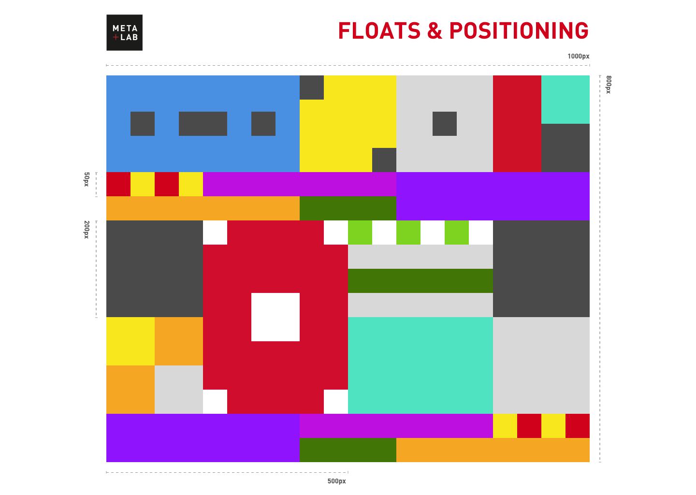

# Floats-and-Positioning
Plain HTML and CSS challenge issued by <a href="https://github.com/csun-metalab/awesome-metalab" target="blank">META+LAB</a> to be done before being considered into their summer internship program in 2017. 

## Objective
The objective for the project is to implement this image of colored squares into plain HTML and CSS:

* _Note that this project was done when I had started learning basic HTML and CSS, so code and its naming conventions may not be done as efficiently and elegantly as I could do now._ 
